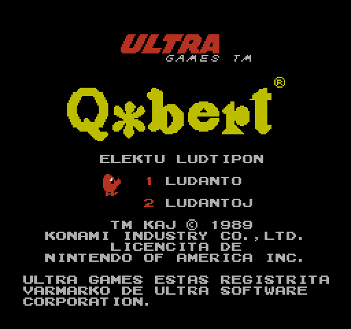
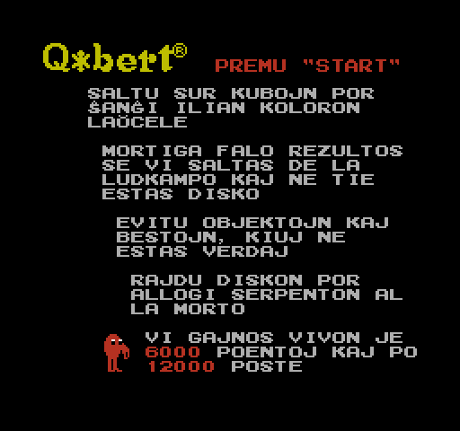
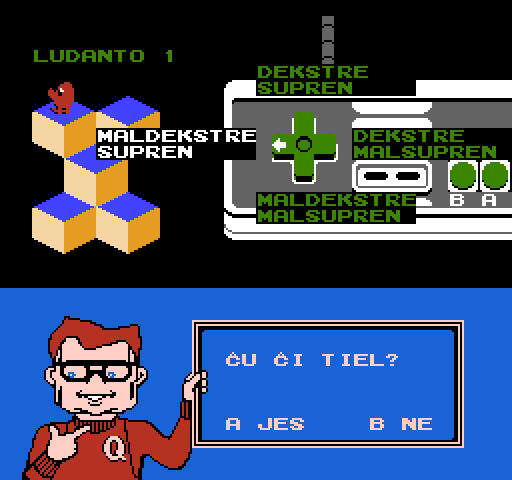
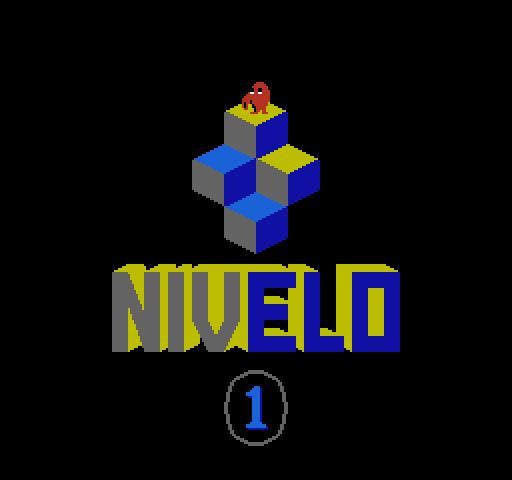
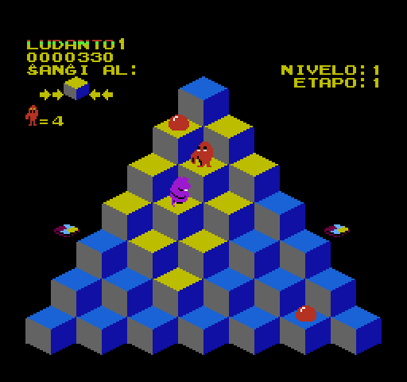

# Q*bert

_Legu
[qbert-readme.txt](qbert-readme.txt) por esperanta priskrbo._

This project is a fan translation of
[Q*bert](https://en.wikipedia.org/wiki/Q*bert), a video game for
the Nintendo Entertainment System, to Esperanto. All copyrights
on the original game belong to Ultra Games and Nintendo.

You *must* own a physical copy of the Q*bert cartridge.
Downloading the ROM of any game which you do not own may be
considered piracy.

  * Q-bert (USA) - CRC32 `8F992F3C`

## Screenshots

Here are some pretty screenshots:

